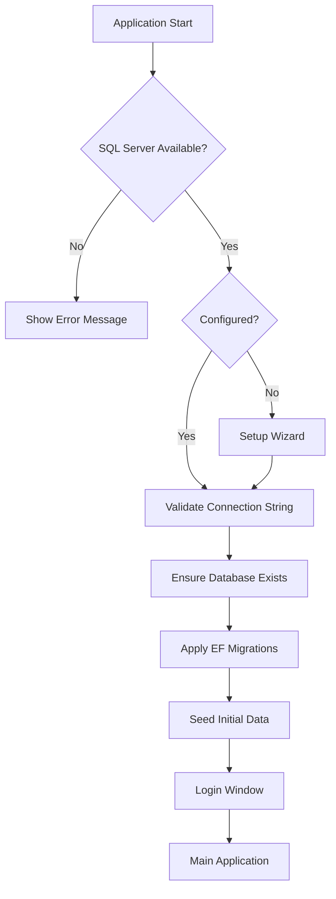

# AlAtaa Clinic — Deployment Guide

## Architecture Overview

```
AlAtaaClinic.sln
├── src/AlAtaaClinic.Domain          # Entities, enums
├── src/AlAtaaClinic.Application     # Business services, validators
├── src/AlAtaaClinic.Infrastructure  # EF Core, repositories, migrations
└── src/AlAtaaClinic.Desktop         # WPF UI, startup, configuration
```

Each clinic deployment uses:

- **Local SQL Server Express** — one database per clinic workstation/server
- **Offline operation** — no internet required after installation
- **External configuration** — `appsettings.json` beside the executable

## Database Migration Strategy

| Phase | Mechanism |
|---|---|
| Database creation | `CREATE DATABASE` via master connection on first launch |
| Schema updates | `Database.MigrateAsync()` — EF Core migrations only |
| Initial data | `SeedData.InitializeAsync()` — idempotent seeding |

### Migrations Location

```
src/AlAtaaClinic.Infrastructure/Migrations/
├── 20260630160352_InitialCreate.cs
├── 20260630174618_DepartmentFeature.cs
└── ClinicDbContextModelSnapshot.cs
```

### Adding a New Migration (Developers)

```powershell
cd src/AlAtaaClinic.Infrastructure
dotnet ef migrations add MigrationName --startup-project ../AlAtaaClinic.Desktop
dotnet ef database update --startup-project ../AlAtaaClinic.Desktop
```

New migrations are applied automatically on next application startup via `IDatabaseInitializer`.

## Build and Publish

### Quick Release Publish

```powershell
cd C:\path\to\Al_Ataa
dotnet publish src/AlAtaaClinic.Desktop/AlAtaaClinic.Desktop.csproj `
  -c Release `
  -r win-x64 `
  --self-contained false `
  -p:PublishReadyToRun=true `
  -o publish/Release
```

Or use the publish profile:

```powershell
dotnet publish src/AlAtaaClinic.Desktop/AlAtaaClinic.Desktop.csproj /p:PublishProfile=FolderProfile
```

### Build the Installer

1. Publish the Release output to `publish/Release/`.
2. Install [Inno Setup 6](https://jrsoftware.org/isinfo.php).
3. Open `installer/AlAtaaClinic.iss` and click **Compile**.
4. Output: `dist/AlAtaaClinic-Setup-1.0.0.exe`

## Published Folder Structure

```
publish/Release/
├── AlAtaaClinic.Desktop.exe          # Main executable
├── AlAtaaClinic.Desktop.dll
├── AlAtaaClinic.Application.dll
├── AlAtaaClinic.Infrastructure.dll   # Includes EF migrations
├── AlAtaaClinic.Domain.dll
├── appsettings.json                  # Connection string (preserved on upgrade)
├── license.dat                       # Created after activation (preserved)
├── Resources/
│   ├── strings.en.json
│   └── strings.ar.json
├── logs/                             # Created at runtime
│   ├── alataa-YYYYMMDD.log
│   ├── startup.log
│   └── crash.log
└── [runtime dependencies].dll
```

## Version Updates

### Update Strategy

1. Increment `<Version>` in `AlAtaaClinic.Desktop.csproj`.
2. Update `#define MyAppVersion` in `installer/AlAtaaClinic.iss`.
3. Add EF migration if schema changed.
4. Publish Release build.
5. Compile installer.

### Preserved Files During Upgrade

The Inno Setup script preserves these files if they already exist:

| File | Purpose |
|---|---|
| `appsettings.json` | Database connection string and clinic settings |
| `license.dat` | License activation data |

Application binaries and dependencies are replaced on upgrade.

### Post-Update Behavior

On first launch after an update:

1. Application reads existing `appsettings.json`
2. Connects to the existing clinic database
3. Applies any pending EF Core migrations automatically
4. Runs idempotent seed (no duplicate admin account)

## Logging Configuration

Configured in `appsettings.json`:

```json
{
  "Serilog": {
    "MinimumLevel": {
      "Default": "Information",
      "Override": {
        "Microsoft": "Warning",
        "Microsoft.EntityFrameworkCore": "Warning"
      }
    }
  }
}
```

Logs are written to `logs/alataa-YYYYMMDD.log` with 30-day retention.

## Startup Sequence



## Security Notes

- Change the default `admin` / `admin123` credentials after first login.
- Restrict file permissions on `appsettings.json` if SQL authentication is used.
- Back up the SQL Server database regularly using SQL Server Management Studio or scheduled backup jobs.

## CI/CD Recommendation

```yaml
# Example pipeline steps
- dotnet restore AlAtaaClinic.sln
- dotnet build AlAtaaClinic.sln -c Release --no-restore
- dotnet publish src/AlAtaaClinic.Desktop/AlAtaaClinic.Desktop.csproj -c Release -r win-x64 -o publish/Release
- iscc installer/AlAtaaClinic.iss
```

Store the installer artifact (`dist/AlAtaaClinic-Setup-*.exe`) for distribution to clinics.
